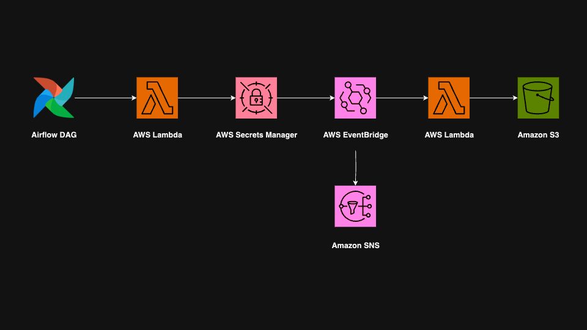

# AWS OAuth Key Collection

## Project Overview
An automated pipeline that retrieves, processes, and stores an OAuth key using AWS services. Constructed with Airflow, AWS Lambda, Secrets Manager, S3, and SNS.

## Screenshot
