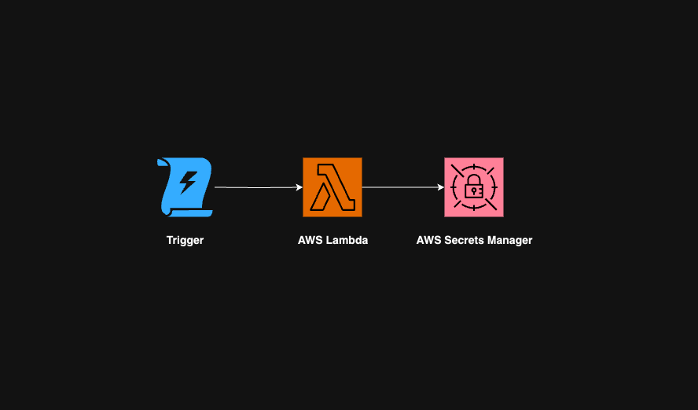

# AWS OAuth Key Collection

## Project Overview
An automated pipeline that retrieves, processes, and stores an OAuth key using AWS services. Constructed with AWS Lambda, Secrets Manager, Terraform and Python

## Screenshot

## Link to the API
https://api.nsw.gov.au/Product/Index/26

## Access token retrieval with 12 hour duration